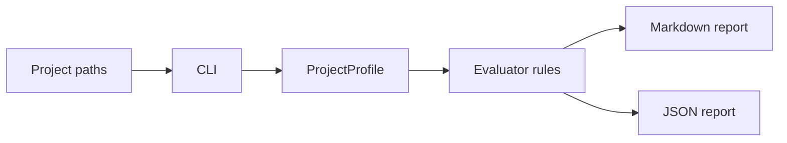

# Architecture

`eval-harness` is a local Ruby CLI with four small layers:

- `CLI`: parses project paths, output format, output path, and failure policy.
- `ProjectProfile`: detects stack shape and file-based signals such as docs, recursive test surfaces, root verification scripts, Railway applicability, manifests, context-pack provenance, and sensitive local files.
- `Evaluator`: turns the profile into explicit rules with `pass`, `warn`, `fail`, or `n/a`.
- Renderers: output Markdown for human review and JSON for future automation.

The design avoids running project-specific test suites. That keeps the first version fast and cross-stack. Project-specific agents still own deep verification; this harness owns the shared preflight contract.

## Data Flow

## Boundary

The harness reads local files and Git state. It does not publish repositories, call GitHub, execute arbitrary project commands, or inspect secrets beyond common sensitive filename warnings. Context-pack freshness is evaluated from embedded source-commit metadata when present and falls back to file mtime for legacy packs.
